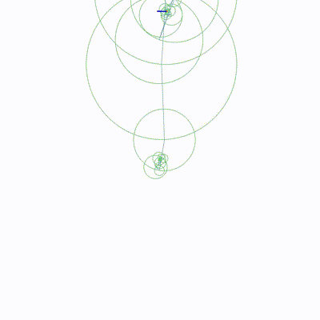
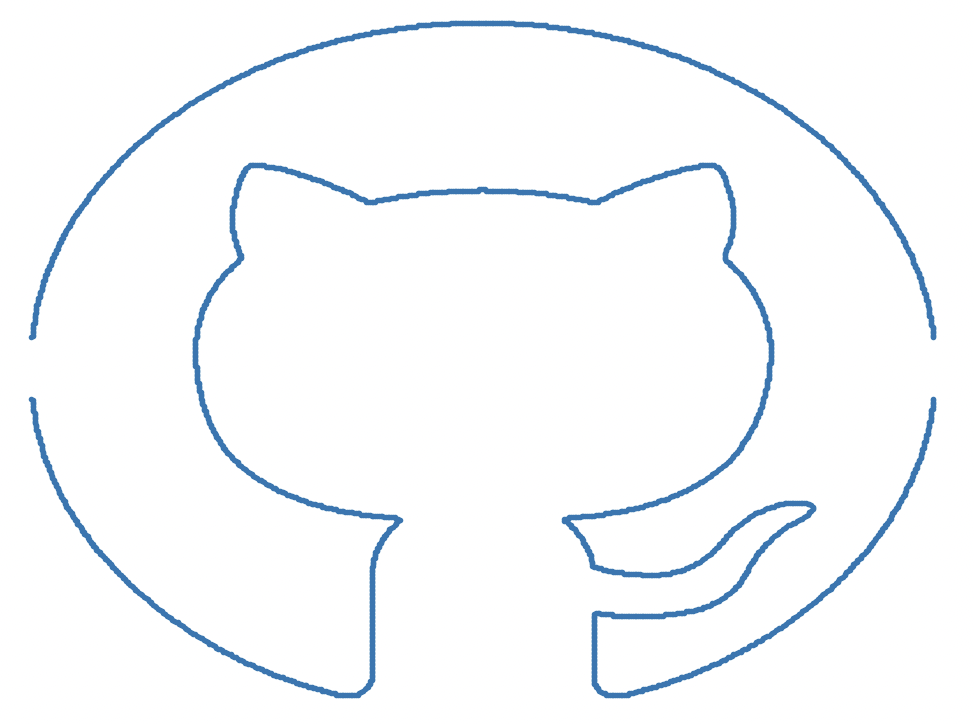

## An example youtube video with MAX resolution(the gifs shown below are heavily compressed to fit into github.

    

1. [Dragon](https://www.youtube.com/watch?v=8C18B097bbs)

## Fourier Drawing Machine

    
    
    

    
    
    

    
    
    

    
    
    

## Images

