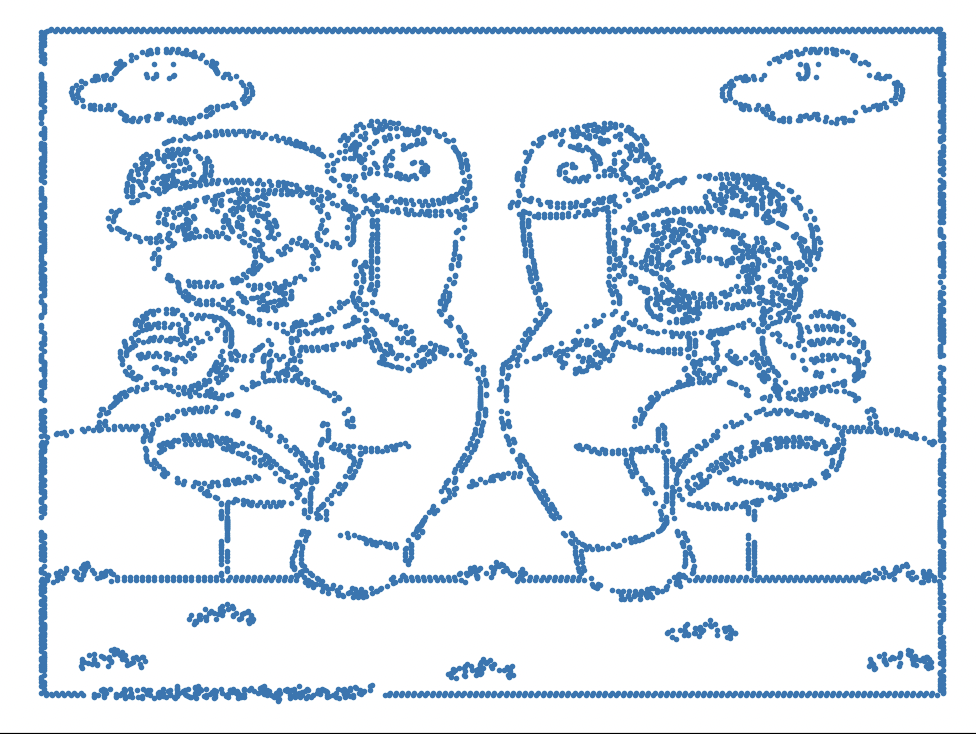
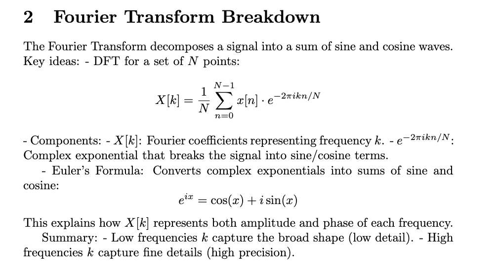
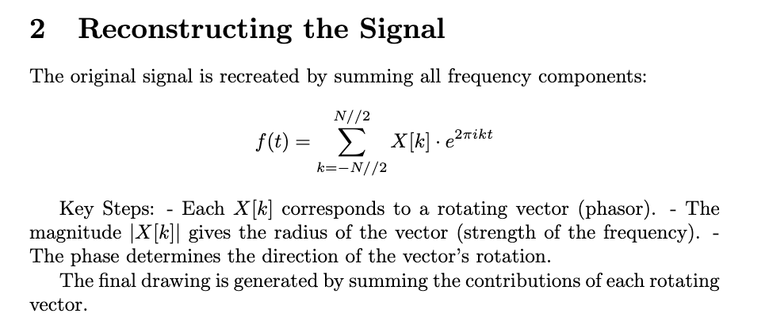
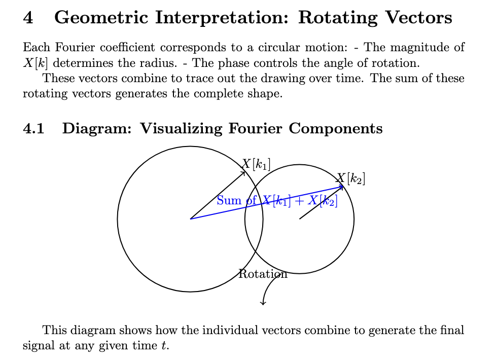

# Note: ALl the gifs and images you see below are low resolution to fit within github's file preview size, to see the full animation of these, refer to these youtube links

## Note: the gifs might take a few secs to load in

# For an explanation of how it works, scroll to the bottom of this page or go to explain/1.png, 2.png, and 3.png.

## YouTube Videos

1. [Dragon](https://www.youtube.com/watch?v=8C18B097bbs)
2. [A Face](https://www.youtube.com/watch?v=FxWh0C7bTS4)
3. [A Body](https://www.youtube.com/watch?v=44Rb9387V88)

Fourier Drawing Machine

    
    
    

## Images

