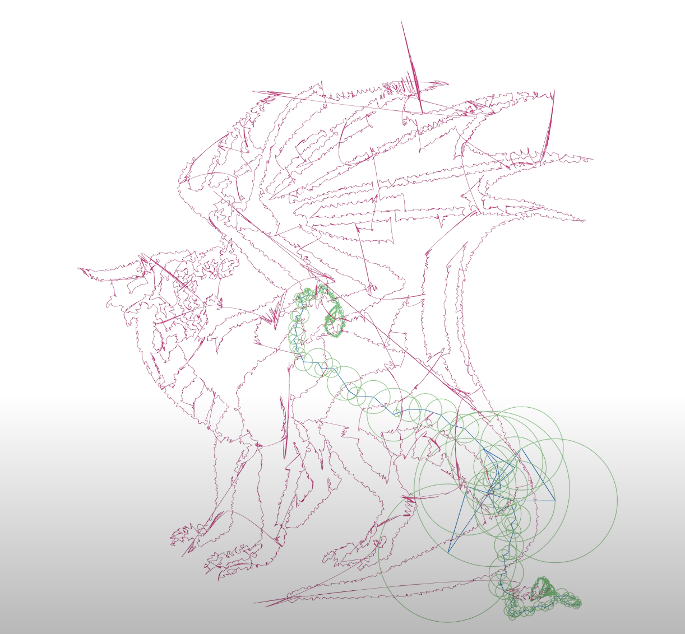
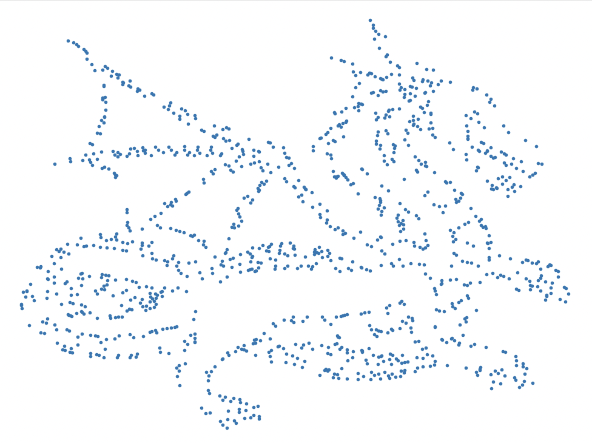
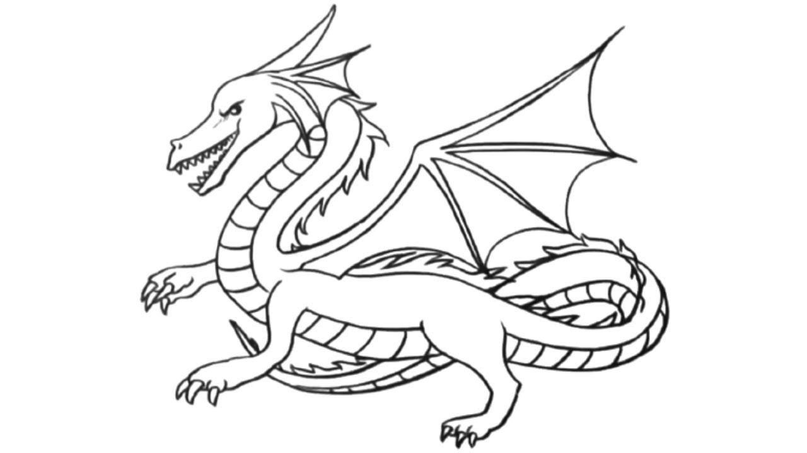

# Note: ALl the gifs and images you see below are low resolution to fit with github, to see the full animation of these, refer to these youtube links
https://www.youtube.com/watch?v=8C18B097bbs 
https://www.youtube.com/watch?v=FxWh0C7bTS4
https://www.youtube.com/watch?v=44Rb9387V88
Fourier Drawing Machine

    

    
    

    
    
    

    
    
    

