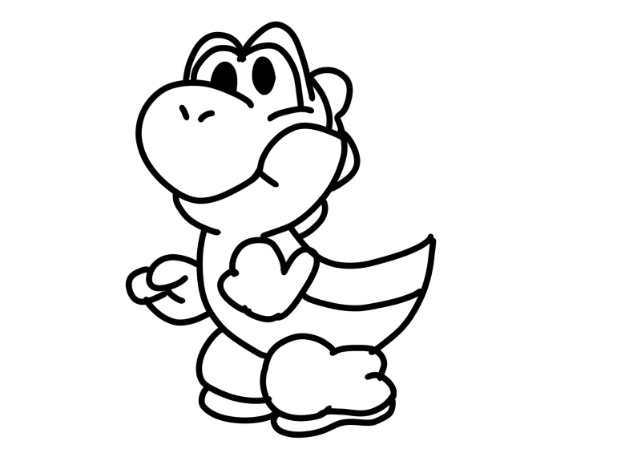
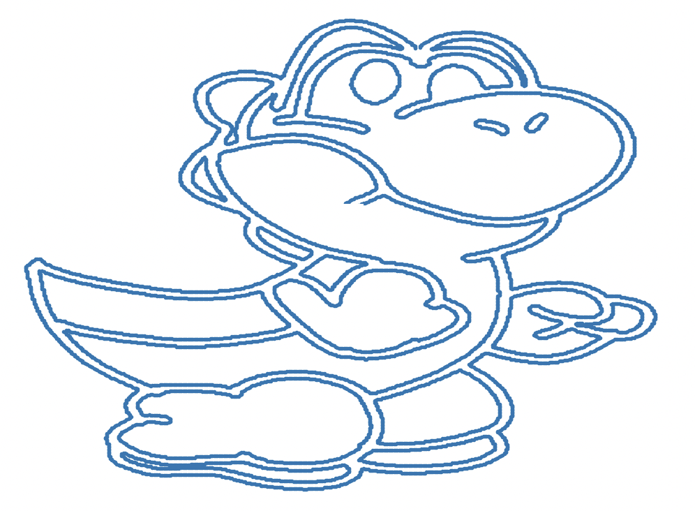
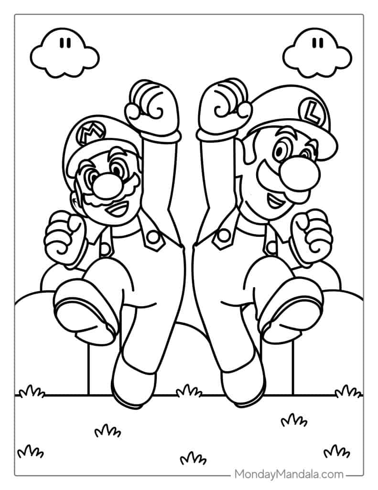
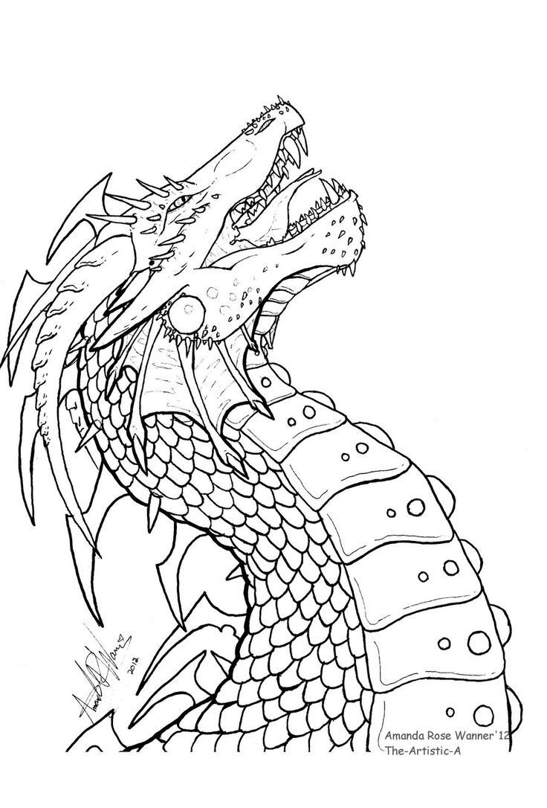
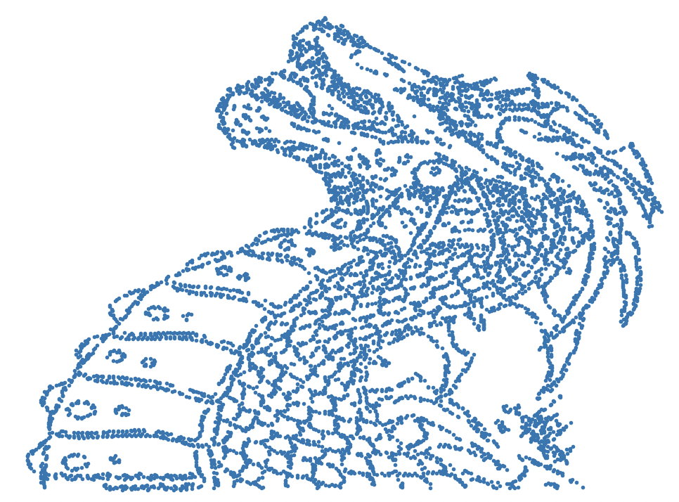

### Main idea (all circles rotate at the same speed and its goal is to go through all of the points.

    

1. [Dragon](https://www.youtube.com/watch?v=8C18B097bbs)

## Fourier Drawing Machine

    
    
    

    
    
    

    
    
    

    
    
    

## Images

